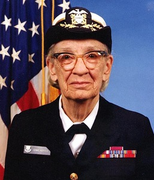

## Grace Murray
Fue una científica  de la computación y militar estadounidense con grado de contraalmirante. Fue pionera en el mundo de las ciencias de la computación y la primera programadora que utilizó el Mark I. Entre las décadas de los 50 y 60 desarrolló el primer compilador para un lenguaje de programación así como también propició métodos de validación

